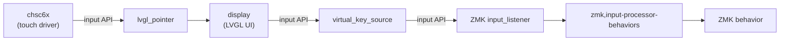

# zmk-module-xiaord

A ZMK module for the Seeed XIAO Round Display. Adds a touch-enabled circular display as a companion device for your keyboard.

## Hardware

- [Seeed Studio XIAO Round Display](https://wiki.seeedstudio.com/get_start_round_display/) (display + touchpad + RTC + microSD)
- Tested with XIAO BLE (nRF52840)

## Features

- Peripheral battery level shown on the display
- BLE connection status display and management
- ZMK behaviors triggered by touch input
- Current time display via RTC

### Home Screen

- **Clock** — current time from the RTC
- **Peripheral battery** — battery level of the split keyboard peripheral
- **Output status** — current output (USB / Bluetooth) and active BT profile

### Home Screen Shortcut Buttons

Up to 12 buttons can be placed around the edge of the screen, indexed clockwise from 12 o'clock (position 0). Default assignments:

| Position | Icon | Action |
|----------|------|--------|
| 0 (12 o'clock) | UPLOAD | Enter bootloader |
| 1 (1 o'clock) | IMAGE | PrintScreen |
| 2 (2 o'clock) | VOLUME MAX | Volume up |
| 3 (3 o'clock) | MUTE | Mute |
| 4 (4 o'clock) | VOLUME MID | Volume down |
| 5 (5 o'clock) | NEXT | Next track |
| 6 (6 o'clock) | PLAY | Play/Pause |
| 7 (7 o'clock) | PREV | Previous track |
| 8 (8 o'clock) | WARNING | Ctrl+Alt+Del |
| 9 (9 o'clock) | USB | Switch to USB output |
| 10 (10 o'clock) | BLUETOOTH | Go to BT management screen |
| 11 (11 o'clock) | SETTINGS | Go to clock settings screen |

### Bluetooth Management Screen

- Select a BT profile (up to 12 profiles)
- Clear a BT profile
- Switch to USB output mode

## Installation

Example config: [zmk-config-fish](https://github.com/TakeshiAkehi/zmk-config-fish.git)

### Adding to west.yml

Add this module to your keyboard config's `config/west.yml`:

```yaml
manifest:
  remotes:
    - name: zmkfirmware
      url-base: https://github.com/zmkfirmware
  projects:
    - name: zmk
      remote: zmkfirmware
      revision: main
      import: app/west.yml
    - name: zmk-module-xiaord
      url: https://github.com/TakeshiAkehi/zmk-module-xiaord.git
      revision: main
  self:
    path: config
```

### Adding to build.yaml

Add `xiaord` to the shield list of the central/dongle target:

```yaml
include:
  - board: xiao_ble//zmk
    shield: xiaord your_keyboard_dongle
    artifact-name: your_keyboard_dongle
  - board: xiao_ble//zmk
    shield: your_keyboard_left
    artifact-name: your_keyboard_left_peripheral
  - board: xiao_ble//zmk
    shield: your_keyboard_left
    artifact-name: your_keyboard_left_central
    cmake-args: -DCONFIG_ZMK_SPLIT_ROLE_CENTRAL=y
```

## Configuration

### Customizing Home Screen Buttons

Override the home buttons by adding a `home_buttons` node to your keyboard's `.overlay` file:

```dts
#include <dt-bindings/xiaord/input_codes.h>

/ {
    home_buttons {
        compatible = "xiaord,home-buttons";

        btn_copy {
            position = <3>;  /* 3 o'clock */
            code = <INPUT_VIRTUAL_SYM_COPY>;
        };
        btn_bt {
            position = <9>;  /* 9 o'clock */
            code = <INPUT_VIRTUAL_SYM_BLUETOOTH>;
            nav-page = <XIAORD_PAGE_BT>;  /* navigate to BT screen on tap */
        };
    };
};
```

`position` is a clockwise index from 0 (12 o'clock) to 11 (11 o'clock). See `include/dt-bindings/xiaord/input_codes.h` for available icon codes.

### Background Image

Three background images are available. Set one in your keyboard's `.conf` or `prj.conf`:

| Setting | Preview |
|---------|---------|
| `CONFIG_XIAORD_BG_1=y` (default) |  |
| `CONFIG_XIAORD_BG_2=y` |  |
| `CONFIG_XIAORD_BG_3=y` |  |

### RTC

Install a **CR927 coin cell** in the XIAO Round Display to retain the time across power cycles. Without a battery the clock resets on every boot.

## License

MIT. Free to use for any purpose. No warranty of any kind.

## Architecture



## Known Limitations / Not Yet Implemented

- Only tested on XIAO BLE (nRF52840)
- Occasional hang on the date-setting screen
- Loading custom background images from microSD
- Font color options other than white
- Battery management UI for the XIAO Round Display itself
